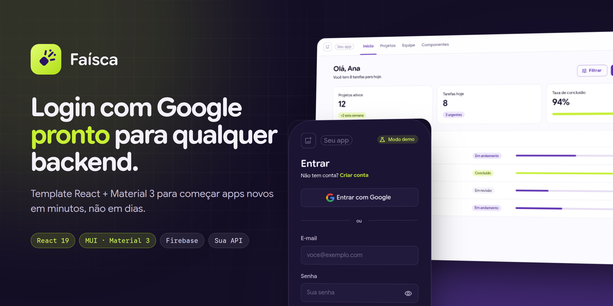
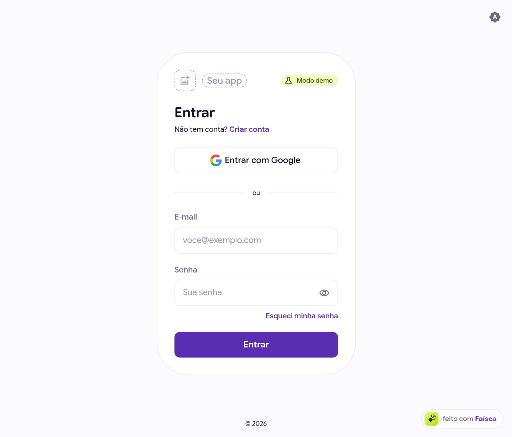
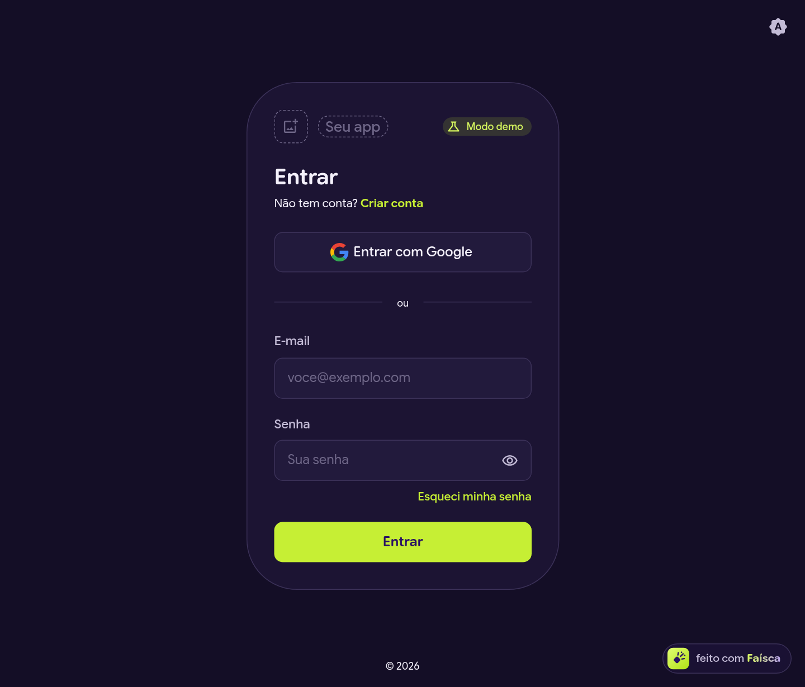
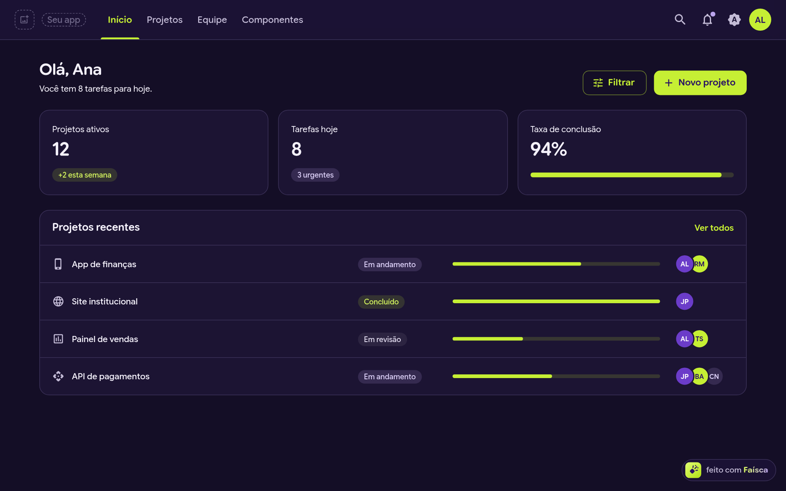
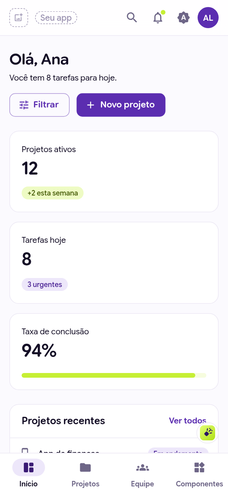
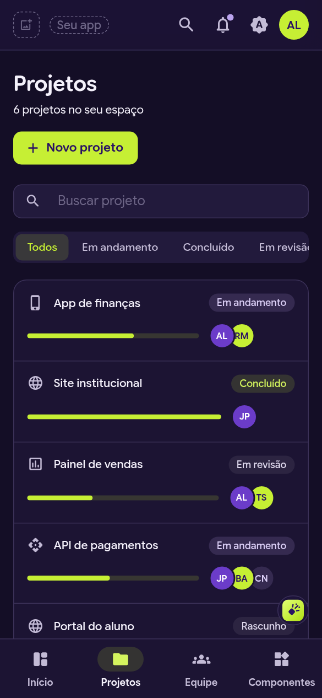
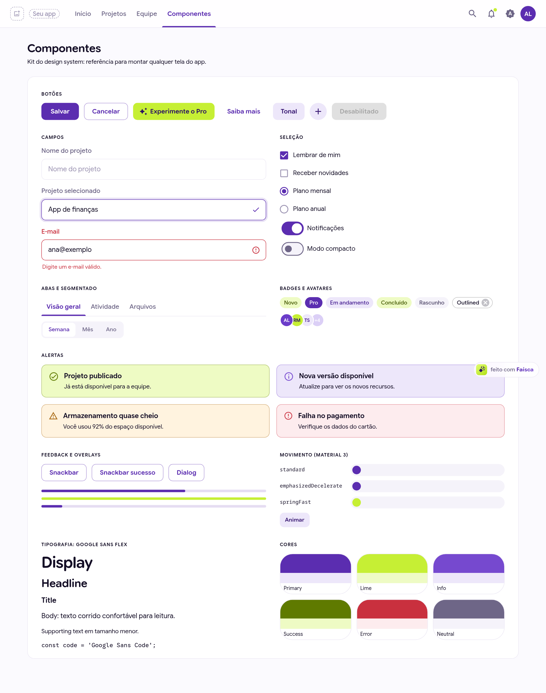
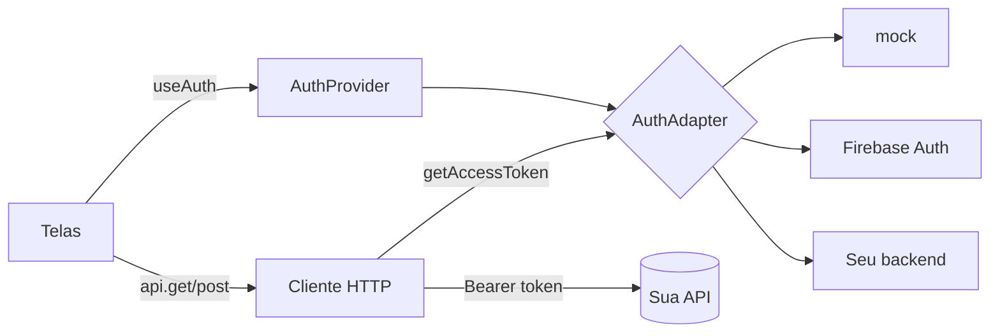
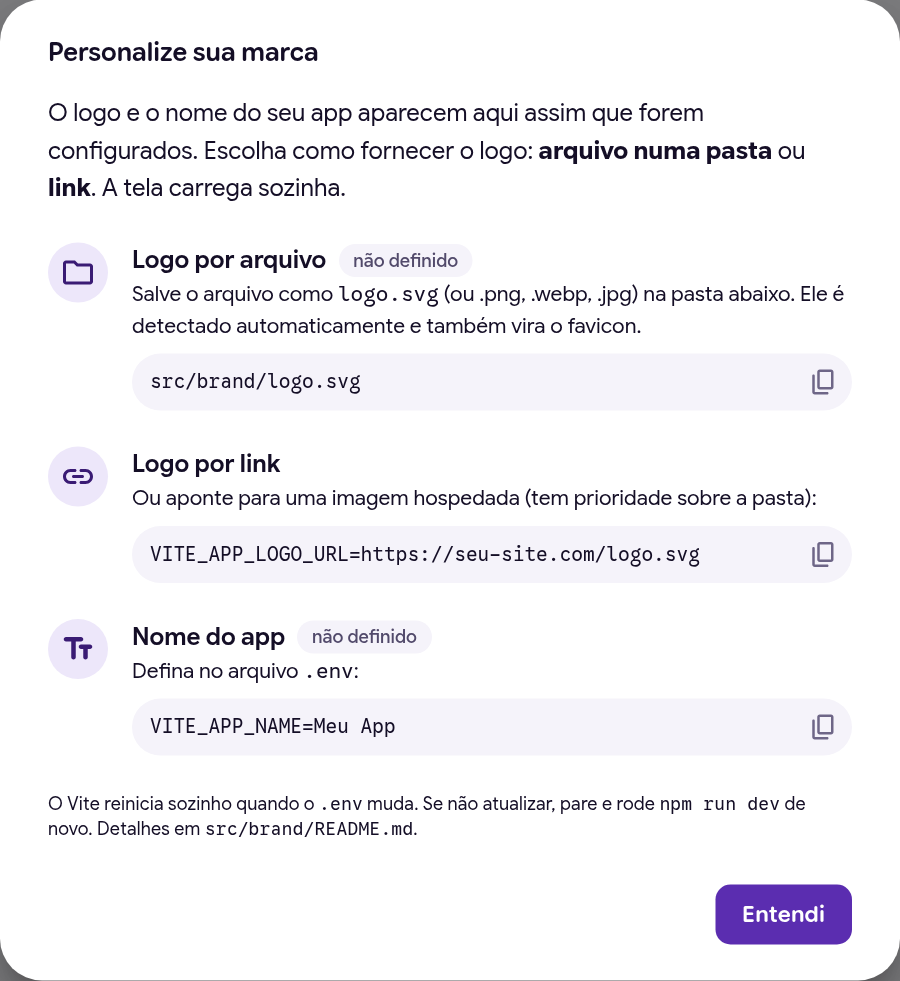

<div align="center">



&nbsp;&nbsp;

# Faísca Auth Starter

<sub>por Rodrigo Bossini</sub>

**O ponto de partida para o seu próximo app React: login com Google, tema Material 3 e uma camada de autenticação que se encaixa em qualquer backend.**

[](https://github.com/professorbossini/faisca-auth-starter/actions/workflows/ci.yml)
[](https://github.com/professorbossini/faisca-auth-starter/generate)
[](LICENSE)


[**Usar este template →**](https://github.com/professorbossini/faisca-auth-starter/generate)

</div>

---

## Para que serve

Todo app novo começa com a mesma lista: tela de login, "Entrar com Google", rota protegida, logout, tema claro/escuro, um cliente HTTP que manda o token... e cada vez isso é refeito do zero, de um jeito diferente.

O **Faísca** acende essa parte uma vez, bem feita, para você **clonar e começar pelo que importa**. E não te prende a nenhum backend:

- **Só front?** Rode no modo `firebase`: o Firebase cuida da sessão e você não escreve servidor.
- **Tem API própria?** Rode no modo `backend`: o template conversa com qualquer stack (Spring, .NET, Django, Laravel, Node, Go...) por um [contrato HTTP simples](docs/backend-contract.md).
- **Só quer desenhar telas?** O modo `mock` funciona **sem nenhuma credencial**, logo depois do `npm install`.

Trocar de modo é mudar **uma variável de ambiente**. Nenhuma tela muda.

## Destaques

- 🔐 **Login com Google** + e-mail/senha, cadastro e recuperação de senha
- 🔌 **Adapters plugáveis**: `mock`, `firebase` e `backend` prontos; crie o seu (Supabase, Auth0, Keycloak...) com [um arquivo](docs/novo-adapter.md)
- 📡 **Cliente HTTP** que anexa o token, renova e repete a chamada sozinho quando recebe 401
- 🛡️ **Rotas protegidas** com retorno à página original depois do login
- 🎨 **Tema Material 3** no MUI: Google Sans Flex, paleta lima + violeta, modo claro/escuro sem piscar
- ✨ **Feedback e movimento M3**: state layers, molas no clique, foco visível, transições entre páginas e respeito a `prefers-reduced-motion`
- 📱 **Responsivo**: abas no desktop, barra de navegação inferior no celular
- 🏷️ **Sua marca em 1 passo**: solte `logo.svg` em `src/brand/` (ou use um link) e ele aparece no app e no favicon; até lá, um placeholder mostra onde
- 🧩 **Kit de componentes** em `/components` como referência viva
- 🧪 **Testes** (Vitest + Testing Library), **ESLint**, **Prettier**, **CI** e **Dependabot**
- 🖥️ **Backend de referência** em Express implementando o contrato completo

## Telas

| Login (claro)                                                               | Login (escuro)                                                              |
| --------------------------------------------------------------------------- | --------------------------------------------------------------------------- |
|  |  |

| Dashboard (escuro)                                                          | Mobile                                                                                                                                                                                              |
| --------------------------------------------------------------------------- | --------------------------------------------------------------------------------------------------------------------------------------------------------------------------------------------------- |
|  |   |

<details>
<summary><strong>Kit de componentes</strong></summary>
<br />

</details>

## Começando em 1 minuto

Pré-requisito: **Node.js 20.19+** (recomendado 22, veja `.nvmrc`).

```bash
git clone https://github.com/<seu-usuario>/<seu-app>.git
cd <seu-app>
npm install
cp .env.example .env
npm run dev
```

Abra http://localhost:5173 e clique em **Entrar com Google**. No modo `mock` (padrão), qualquer e-mail e senha funcionam. Dica: e-mails com "erro" simulam falha de login.

## Criando um app novo a partir do template

### Opção 1: "Use this template" (recomendado)

É o jeito certo de **começar um projeto novo**: o repositório nasce limpo, com um histórico só seu e sem vínculo com este.

1. Clique em [**Use this template → Create a new repository**](https://github.com/professorbossini/faisca-auth-starter/generate).
2. Escolha o dono, o nome (ex.: `meu-app`) e a visibilidade.
3. Clone o repositório novo e siga o [Começando em 1 minuto](#começando-em-1-minuto).

Ou pelo terminal, com o [GitHub CLI](https://cli.github.com/):

```bash
gh repo create meu-app --template professorbossini/faisca-auth-starter --public --clone
cd meu-app && npm install && cp .env.example .env && npm run dev
```

### Opção 2: fork

Faça fork quando você quer **contribuir com o template** ou **acompanhar as atualizações dele** de perto.

1. Clique em **Fork** no topo desta página.
2. Clone o seu fork: `git clone https://github.com/<seu-usuario>/faisca-auth-starter.git`
3. Para trazer novidades do original depois:

   ```bash
   git remote add upstream https://github.com/professorbossini/faisca-auth-starter.git
   git fetch upstream
   git merge upstream/main
   ```

> **Template ou fork?** Template para criar um produto novo; fork para evoluir o próprio template. Na dúvida, template.

Se você usou o template e quer puxar uma melhoria específica depois, dá para buscar o commit direto: `git remote add faisca https://github.com/professorbossini/faisca-auth-starter.git && git fetch faisca && git cherry-pick <commit>`.

## Escolha o modo de autenticação

| Modo                | `VITE_AUTH_PROVIDER` | Precisa de                | Sessão                                      | Ideal para                                     |
| ------------------- | -------------------- | ------------------------- | ------------------------------------------- | ---------------------------------------------- |
| **Demo**            | `mock`               | nada                      | simulada (localStorage)                     | desenhar telas, aulas, protótipos              |
| **Firebase**        | `firebase`           | projeto Firebase          | persistente, renovação automática           | apps só-front ou com API que valida o ID token |
| **Backend próprio** | `backend`            | OAuth Client ID + sua API | JWT em memória + refresh em cookie httpOnly | sistemas com API e banco próprios              |

O passo a passo de cada um está em **[docs/configuracao-google.md](docs/configuracao-google.md)**.

### Front precisa de back?

Depende do que o app faz depois do login. Para **identificar o usuário** ou chamar APIs do Google em nome dele, o front basta. Para **proteger dados de verdade**, alguém no servidor precisa validar o token: o seu backend ou um BaaS como o Firebase. Qualquer checagem feita só no navegador pode ser burlada. O template já nasce preparado para os dois cenários.

## Configuração

Todas as variáveis ficam no `.env` (copie de [`.env.example`](.env.example)). Elas são lidas e validadas em [`src/config/env.ts`](src/config/env.ts): se faltar alguma, o app mostra uma tela explicando exatamente qual.

| Variável                     | Modo     | Descrição                                     |
| ---------------------------- | -------- | --------------------------------------------- |
| `VITE_APP_NAME`              | todos    | Nome exibido no app e na aba do navegador     |
| `VITE_APP_LOGO_URL`          | todos    | Link do logo (prioridade sobre `src/brand/`)  |
| `VITE_SHOW_POWERED_BY`       | todos    | `false` esconde o selo "feito com Faísca"     |
| `VITE_AUTH_PROVIDER`         | todos    | `mock`, `firebase` ou `backend`               |
| `VITE_ENABLE_EMAIL_PASSWORD` | todos    | `false` para deixar só o botão do Google      |
| `VITE_API_URL`               | todos    | URL da sua API. Vazio = dados de demonstração |
| `VITE_FIREBASE_API_KEY`      | firebase | Do `firebaseConfig` do console                |
| `VITE_FIREBASE_AUTH_DOMAIN`  | firebase | 〃                                            |
| `VITE_FIREBASE_PROJECT_ID`   | firebase | 〃                                            |
| `VITE_FIREBASE_APP_ID`       | firebase | 〃                                            |
| `VITE_GOOGLE_CLIENT_ID`      | backend  | OAuth Client ID (tipo Web) do Google Cloud    |

> Tudo que começa com `VITE_` vai para o navegador. **Nunca** coloque segredos (client secret, chaves privadas) no `.env` do front.

## Usando a sessão no seu código

```tsx
import { useAuth } from '@/auth';

function Perfil() {
  const { user, status, signOut } = useAuth();
  if (status === 'loading') return null;
  return <button onClick={signOut}>Sair, {user?.name}</button>;
}
```

Chamando a sua API, com o token anexado, renovação e retry automáticos:

```ts
import { api, ApiError } from '@/api';

const projetos = await api.get<Projeto[]>('/projects', { query: { page: 1 } });
await api.post('/projects', { name: 'Novo' });
await api.get('/health', { auth: false }); // rota pública, sem token
```

Protegendo uma página nova: adicione-a como filha da rota `AppLayout` em [`src/router.tsx`](src/router.tsx) e ela passa a exigir login.

## Arquitetura

```
src/
├── auth/                 # 🔐 autenticação (independente de provedor)
│   ├── types.ts          #    contrato AuthAdapter + AuthUser
│   ├── AuthProvider.tsx  #    contexto React + useAuth()
│   ├── guards.tsx        #    <RequireAuth> e <RedirectIfAuthenticated>
│   ├── errors.ts         #    erros normalizados + mensagens em pt-BR
│   └── adapters/         #    mock · firebase · backend (carregados sob demanda)
├── api/                  # 📡 cliente HTTP (token, 401 → refresh → retry, timeout)
├── config/env.ts         # ⚙️ variáveis de ambiente tipadas e validadas
├── theme/                # 🎨 tokens, tema MUI (M3), movimento
├── components/           # 🧩 marca, campos, feedback, splash...
├── layouts/              # AuthLayout (telas públicas) e AppLayout (área logada)
├── pages/                # telas: login, cadastro, senha, dashboard...
└── features/projects/    # exemplo de feature: tipos, serviço (API ou demo) e UI
examples/backend-express/ # 🖥️ API de referência do contrato
docs/                     # 📚 guias
```



Decisões que tornam o template robusto:

- **Um contrato, vários provedores.** As telas não sabem se o login é Firebase, Supabase ou Spring Security.
- **Token fora do `localStorage`.** No modo `backend`, o access token vive em memória e o refresh token num cookie `httpOnly`, fora do alcance de XSS.
- **Renovação transparente.** Um 401 dispara um refresh e **uma** nova tentativa; chamadas simultâneas compartilham o mesmo refresh.
- **Code splitting.** O SDK do Firebase só é baixado quando o modo `firebase` está ativo.
- **Falha amigável.** Configuração errada vira uma tela explicativa, não uma página em branco.

## Sua marca

Um app recém-criado mostra **placeholders transparentes** no lugar do logo e do nome, e clicar neles abre um guia rápido. Para trocar:

| O quê                | Como                                                                                                                                         |
| -------------------- | -------------------------------------------------------------------------------------------------------------------------------------------- |
| **Logo por arquivo** | Salve como `src/brand/logo.svg` (ou `.png`, `.webp`, `.avif`, `.jpg`). É detectado automaticamente, com hot reload, e também vira o favicon. |
| **Logo por link**    | `VITE_APP_LOGO_URL=https://seu-site.com/logo.svg` no `.env` (tem prioridade sobre a pasta).                                                  |
| **Nome**             | `VITE_APP_NAME=Meu App` no `.env`. Também preenche o título da aba.                                                                          |

<p align="center"></p>

No canto inferior da tela fica o selo **"feito com Faísca"**, com as marcas do Faísca e do Bossini lado a lado: um lembrete de onde o app nasceu (e um link para este repositório). Ele pode ser escondido com `VITE_SHOW_POWERED_BY=false`, mas então a [licença](LICENSE) pede o mesmo crédito em outro lugar visível do app, como o rodapé ou uma página "Sobre".

## Tema e design

Tema MUI com **Material Design 3** e a tipografia dos materiais de IA do Google (**Google Sans Flex** com terminais arredondados e **Google Sans Code**), servida localmente via Fontsource. Paleta lima `#C6EF34` + violeta `#5B2DB0`, modo claro/escuro e tokens de movimento do M3.

Para trocar cores, fonte, ícone e nome, veja **[docs/tema.md](docs/tema.md)**.

## Scripts

| Comando                           | O que faz                                            |
| --------------------------------- | ---------------------------------------------------- |
| `npm run dev`                     | Servidor de desenvolvimento em http://localhost:5173 |
| `npm run build`                   | Checagem de tipos + build de produção em `dist/`     |
| `npm run preview`                 | Serve o build localmente                             |
| `npm test` / `npm run test:watch` | Testes (Vitest)                                      |
| `npm run lint`                    | ESLint                                               |
| `npm run format`                  | Prettier                                             |
| `npm run typecheck`               | Só a checagem de tipos                               |

## Checklist do app novo

- [ ] Logo em `src/brand/logo.svg` (ou `VITE_APP_LOGO_URL`) e `VITE_APP_NAME` no `.env`
- [ ] `name` no `package.json`
- [ ] Cores em `src/theme/tokens.ts` (se quiser outra identidade)
- [ ] Modo de autenticação e credenciais **próprias do projeto** no `.env`
- [ ] Origens autorizadas no Google Cloud / Firebase (localhost + produção)
- [ ] Apagar o que for demonstração: `src/features/projects`, `TeamPage`, `ComponentsPage` (ou manter como referência)
- [ ] Atualizar este README 🙂

## Deploy

É um SPA estático: `npm run build` gera a pasta `dist/`. Já vêm prontos:

- **Vercel**: `vercel.json` com rewrite para `index.html` e headers.
- **Netlify / Cloudflare Pages**: `public/_redirects` e `public/_headers`.
- **Firebase Hosting**: `firebase init hosting` com _public directory_ `dist` e _single-page app_ = sim.

Em qualquer host, lembre de: (1) autorizar o domínio de produção no Google Cloud/Firebase e (2) servir o header `Cross-Origin-Opener-Policy: same-origin-allow-popups`, necessário para o popup do Google.

## Mantendo o template vivo

Templates envelhecem. Este repositório tem **Dependabot** mensal agrupando atualizações (MUI, React, tooling) e **CI** rodando lint, testes e build em cada PR. Ao começar um semestre ou projeto novo, rode `npm outdated` e atualize.

## Contribuindo

Issues e PRs são bem-vindos! Veja [CONTRIBUTING.md](CONTRIBUTING.md). Os commits seguem [Conventional Commits](https://www.conventionalcommits.org/) em inglês.

## Licença

Licença Faísca (MIT com atribuição) © Rodrigo Bossini. O projeto é **livre**: use, copie, modifique, distribua e venda à vontade, inclusive em projetos comerciais. Há só duas condições:

1. **Mantenha a referência ao Faísca** visível para quem usa o app. O selo "feito com Faísca" já cumpre isso; se escondê-lo, mostre o crédito (nome Faísca, as duas marcas e o link para este repositório) em outro lugar visível, como o rodapé ou uma página "Sobre".
2. **Não altere as marcas** do Faísca e do Bossini: formas, cores e proporções ficam como estão (redimensionar pode). Trocar o favicon padrão e o placeholder de logo pela marca do seu app continua liberado.

O texto completo está em [LICENSE](LICENSE).
