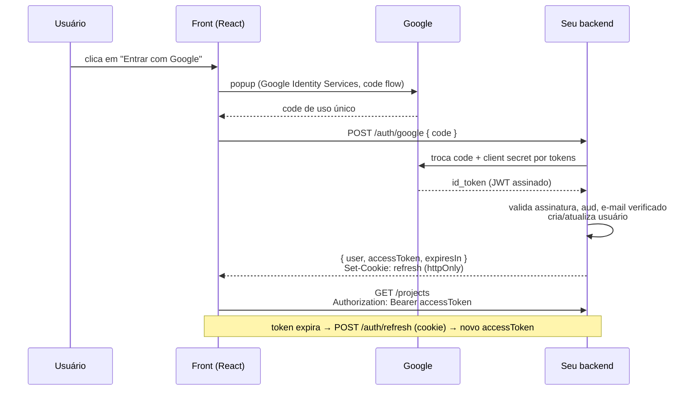

# Contrato do backend (`VITE_AUTH_PROVIDER=backend`)

Este é o contrato que o adapter [`src/auth/adapters/backend.ts`](../src/auth/adapters/backend.ts) espera. Implemente estes endpoints em **qualquer linguagem** e o front funciona sem mudar uma linha. A implementação de referência está em [`examples/backend-express`](../examples/backend-express).

Todos os caminhos são relativos a `VITE_API_URL` (ex.: `https://api.meuapp.com/api`). Se precisar de outros caminhos, edite `BACKEND_AUTH_ENDPOINTS` no adapter.

## Visão geral do fluxo



## Formato da sessão

Os endpoints de login, cadastro e refresh respondem com:

```jsonc
{
  "user": {
    "id": "u_123", // obrigatório
    "email": "ana@exemplo.com",
    "name": "Ana Lima",
    "photoUrl": "https://...",
    "emailVerified": true,
    "signInMethod": "google", // "google" | "password"
  },
  "accessToken": "eyJhbGciOi...", // opcional (ver estratégias abaixo)
  "expiresIn": 900, // segundos até o accessToken expirar
}
```

### Duas estratégias de sessão

| Estratégia                                | O que o backend faz                                                                     | Quando usar                                           |
| ----------------------------------------- | --------------------------------------------------------------------------------------- | ----------------------------------------------------- |
| **Bearer + refresh cookie** (recomendada) | Devolve `accessToken` curto (5–15 min) no corpo e um refresh token em cookie `httpOnly` | APIs stateless, microsserviços, apps mobile no futuro |
| **Cookie de sessão**                      | Omite `accessToken`; usa só um cookie `httpOnly` de sessão                              | Monólitos tradicionais (Django, Rails, Laravel...)    |

O front guarda o `accessToken` **só em memória** (nunca em `localStorage`) e envia `credentials: 'include'` em todas as chamadas, então as duas estratégias funcionam.

## Endpoints

### `POST /auth/google`

Troca o authorization code do Google por uma sessão.

- **Body:** `{ "code": "4/0Ab..." }`
- **No servidor:**
  1. troque o code por tokens em `https://oauth2.googleapis.com/token` usando `client_id`, `client_secret`, `grant_type=authorization_code` e **`redirect_uri=postmessage`**;
  2. valide o `id_token`: assinatura, `aud == client_id`, `iss` em `accounts.google.com`, `exp`;
  3. exija `email_verified == true`;
  4. crie ou atualize o usuário (vincule pelo `sub` do Google ou pelo e-mail).
- **200:** sessão · **401:** code inválido.

### `POST /auth/login`

- **Body:** `{ "email": "...", "password": "..." }`
- **200:** sessão · **401:** `{ "code": "invalid-credentials" }`

### `POST /auth/register`

- **Body:** `{ "name": "...", "email": "...", "password": "..." }`
- **200:** sessão · **400:** `invalid-email` / `weak-password` · **409:** `email-in-use`

### `POST /auth/password-reset`

- **Body:** `{ "email": "..." }`
- **204** sempre, exista ou não a conta (não revele quais e-mails estão cadastrados).

### `POST /auth/refresh`

Chamado quando o app abre (para restaurar a sessão) e quando o access token expira ou a API responde 401.

- **Sem body.** Lê o refresh token do cookie.
- **200:** sessão nova (faça **rotação**: invalide o refresh token usado e emita outro) · **401:** sem sessão.

### `POST /auth/logout`

- Revoga o refresh token e apaga o cookie. **204.**

## Erros

Responda com o status HTTP adequado e, se quiser uma mensagem específica na tela, inclua `code`:

```json
{ "code": "too-many-requests", "message": "Muitas tentativas" }
```

Códigos reconhecidos: `invalid-credentials`, `email-in-use`, `weak-password`, `invalid-email`, `user-disabled`, `too-many-requests`, `not-supported`. Sem `code`, o front deduz pelo status: 401 → credenciais inválidas, 403 → conta desativada, 409 → e-mail em uso, 429 → muitas tentativas.

## Protegendo suas rotas

Toda chamada feita com o cliente [`api`](../src/api/index.ts) envia `Authorization: Bearer <accessToken>`. No backend, valide o JWT (assinatura, `exp`, `iss`, `aud`) antes de liberar o recurso. Se a resposta for **401**, o front renova o token e repete a chamada **uma vez**; se falhar de novo, desloga o usuário.

## Checklist de segurança

- [ ] Client secret só no servidor (variável de ambiente).
- [ ] Cookie de refresh com `HttpOnly`, `Secure` (produção), `SameSite=Lax` (ou `None` + `Secure` se front e API estiverem em sites diferentes) e `Path` restrito a `/auth`.
- [ ] Refresh tokens guardados como hash e rotacionados a cada uso.
- [ ] CORS liberando apenas as origens do front, com `credentials: true`.
- [ ] Rate limit nos endpoints de `/auth`.
- [ ] Senhas com hash lento (scrypt, argon2 ou bcrypt).
- [ ] HTTPS em produção.
